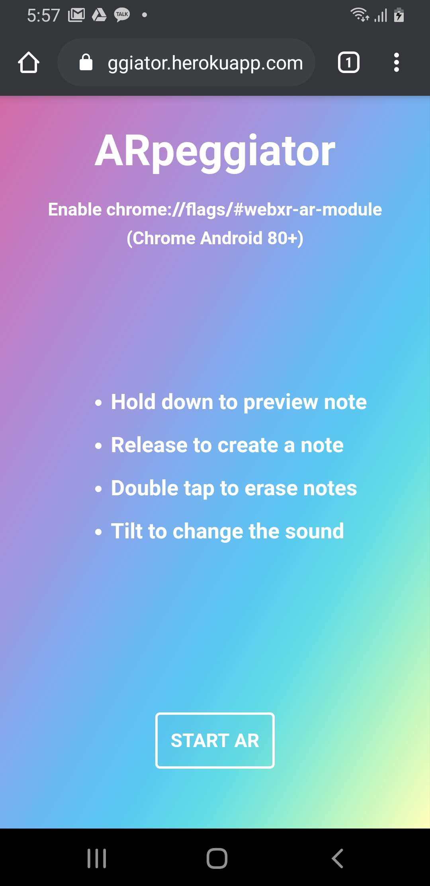

# ARpeggiator


ARpeggiator is a collaborative AR music making application. (Works in Chrome on Android devices)

Here's the [Live Demo on Heroku](https://ar-peggiator.herokuapp.com/).

## How to play
* Make sure the sound on your phone is turned on.
* Touch the [START AR] button to start the app.
* Touch and hold down on the screen to see the preview note.
* Release your touch to create a note on the location.
* Double tap on the screen to erase all notes in the camera view.
* Try tilting your phone to hear the sound changing.

## Setup
1. Installation of node.js is required. Follow [this guide](https://github.com/itp-dwd/2020-spring/blob/master/guides/installing-nodejs.md) to install it.
2. Run the following commands in the Terminal.
```
git clone https://github.com/cuinjune/ar-peggiator.git
cd ar-peggiator
npm install dependencies
npm start
```
3. Open your web browser and navigate to http://localhost:3000

## Tools & Libraries used
webxr, three.js, pure data, emscripten, node.js, express, socket.io, uuid

## References
* https://threejs.org/examples/webxr_ar_cones.html
* https://threejs.org/examples/jsm/webxr/ARButton.js
* https://github.com/marquizzo/three-gimbal

## Reporting bugs
Please post an [issue](https://github.com/cuinjune/ar-peggiator/issues) if you face any problem using the app.

## Author
* [Zack Lee](https://www.cuinjune.com/about): an MPS Candidate at [NYU ITP](https://itp.nyu.edu).
